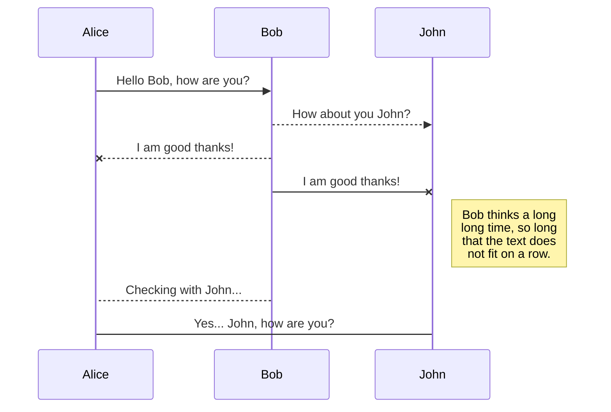

# SimApi Building Energy Co-Simulation Platform

This project aims to develop a RestFul API for building energy management systems (EMS). The software architecture is developed using the combination of PHP + MySQL on top of a Laravel 4.x framework.
It extends the functionalities of [BCVTB](https://simulationresearch.lbl.gov/bcvtb) exposing several endpoints for the control of a building simulation.
The web interace shows also a graphic dashboard for the visualisation of aggregated data. It has been tested with [EnergyPlus](https://energyplus.net/) on a calibrated smart-grid ready building model for research purposes.
The API blueprint and the documention can be found at UCD [SimApi website](http://simapi.ucd.ie/document).

The  software package is divided in two separated parts, the web platform and the mediator//actors interface. The webplatform requires 

